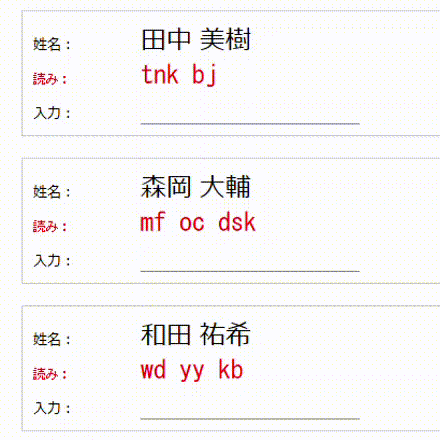

# direct-input23
 
direct-input23.ahk は、IME を使用せずに漢字を入力できる AutoHotKey 用のスクリプトです。



使い方および詳細については、[note の記事](https://note.com/kouie/n/nfeccadad26a5) をご覧ください (note 記事と異なる動作がある場合は、本 Readme を参照してください)。

最新のバージョンは `1.1.0` です。このバージョンで変更・追加された機能は次のとおりです。

1. [動作対象と辞書ファイルの指定場所](#動作対象と辞書ファイルの指定場所)

2. [IME の併用に関する動作と設定](#ime-の併用に関する動作と設定)

3. [登録済みエントリの「読み」検索](#登録済みエントリの読み検索)

4. [単語登録](#単語登録)

5. [入力履歴と再変換履歴](#入力履歴と再変換履歴)

6. [辞書の切替](#辞書の切替)

重要: 前バージョンをご利用いただいている方も、上記 1. と 2. について設定が必要です。

## 動作対象と辞書ファイルの指定場所

本スクリプトの動作対象 (ウィンドウ) および辞書ファイルの指定場所が `direct-input23.ini` ファイルに変更されました。

#### 動作対象ウィンドウの指定

`[Group]` セクションの `group=` に `,` 区切りで指定します。
```
[Group]
group=メモ帳,Chrome
```
注意: 行の末尾に `,` を付けないでください。

#### 辞書ファイル

`[Filesect(番号)]` セクションの `dict=` に指定します。同時に設定する項目がありますが、これらは後の「[辞書の切替](#辞書の切替)」セクションで説明します。

```
[FileSet1]
name=Dictionary-1
dict=dictionary.txt
log=convert_history.txt
```

注意: .ini ファイルは `Shift-JIS` で作成してください。


## IME の併用に関する動作と設定

辞書に登録されていない漢字は IME で入力するわけですが、前バージョンではそのたびにスクリプトをサスペンドする使い方を想定していました。本バージョンでは、

+ IME をオンにすると、直接変換をオフ
+ IME をオフにすると、直接変換をオン

にするようにしています (サスペンドさせない)。こちらの方がスムースな感じがしたのですが、気のせいかもしれません。

IME のオン/オフは通常どおり `半角/全角` キーで行いますが、実際のキー入力を発生させずに、スクリプト側で IME の状態を変更しています。環境によって、この辺りの動作が問題になりそうな場合はご注意ください。

キーの入力ごとに IME のオン/オフを判定しているので、速度面で動作が不安定になる可能性があります。使い初めからしばらくは入力漏れなどがないかよくご確認ください (自分の 10 年くらい前の古い PC でもキーを取りこぼすような問題は発生してませんが、念のため)。

IME の使用頻度は辞書の完成度しだいで変わってくると思いますので、このあたりの動作は今後もう少し詰めて、設定で切り替えできるようにした方がいいかなと思っています。

また、`F1` キーで IME を指定入力モードでオンにできます。特定のモード (半角固定など) で入力する頻度が高い場合は、そちらも利用してみてください。初期状態では「半角英数」モードに切り替わるようになっています。解除は `半角/全角` キーです (F1 キーの二度押しでは解除されません)。`F1` の割り当ては変更可能です。

#### 設定

ヒント: 使用する IME (側) の設定や環境によっては、特に設定しなくても動く場合があるようです。IME が普段どおりに動作しない場合は、こちらの手順で設定してみてください。

ご使用中の IME の種類に応じて、`direct-input23.ini` の次のセクションに入力モードと変換モードを設定します (「ひらがな」とか「連文節」とかです)。

```
[ConvMode]
mode=25
[SentenceMode]
mode=8
[F1ConvMode]
mode=16
[F1SentenceMode]
mode=0
```

指定する値は、付属の `ime_mode_test.ahk` スクリプトで確認できます (eamat. 氏製の IME.ahk の仕様に準じています)。現在の IME の状態に応じて各モードの値が表示されますので、`[ConvMode]` に入力モード、`[SentenceMode]` に変換モードを、それぞれ `mode=` の後に指定してください。

`[F1～]` の方には F1 キーでオンにする入力・変換モードを指定します。これらの値も、設定したい IME のモードを  `ime_mode_test.ahk` スクリプトで調べて、同様に指定してください (ホットキーの割り当てを F1 以外に変更した場合も、"F1" の部分は変更しないでください)。


## 登録済みエントリの「読み」検索

辞書に登録した漢字の読みが思い出せない場合に利用してください。

カーソル位置から 1 文字戻って文字列を取得し (内部で `+{LEFT}^c` します)、クリップボードの内容で辞書内を検索して、結果をメッセージボックスに表示します。検索した単語が登録されていない場合は、メッセージボックス自体表示されません。

この機能はホットキーの `^g` に割り当てています。IME オン → 検索する漢字の入力 → `^g` で検索、というフローを想定しています。検索後に IME をオフにしていますので、お好みで変更してください。

## 単語登録

辞書エントリを、クリップボード経由で辞書ファイルに登録します。

```
tak=高尾
```

のように、辞書エントリと同じ形式の文字列をクリップボードにコピーしたうえで、`^F8` を押してください。
同じ読みのエントリがすでに登録されている場合は該当エントリを修正、同じ読みがない場合は辞書ファイルの末尾にエントリを追加します。

一度に登録できるエントリは 1 件のみです。

辞書を更新する際に、``日付時刻 + 辞書ファイル名`` という形式の名前でバックアップファイルが作成されます。バックアップは辞書ファイルを更新するごとに作成されますので、追加・変更するエントリがたくさんある場合は直接テキストエディタで編集することをお勧めします (「バックアップを作成せずに更新」ボタンはいつか作ります)。

削除機能は (いまのところ) ありません。エントリを削除したい場合もテキストエディタで。

辞書はたいへん貴重な資産ですから、定期的にバックアップを取って大切に扱いましょう (経験談)。

キーバインドは変更可能です。

重要: 辞書ファイルの改行コードは `CRLF` です。お手元のファイルが `LF` になっている場合は、お手数ですが `CRLF` への変更をお願いします。

## 入力履歴と再変換履歴

定期的に入力内容・再変換の履歴をログファイルに出力します。後述するスクリプトなどを使用して統計情報を作成し、辞書の最適化などに利用してください。

入力および再変換した単語をまずバッファに格納し、入力デバイス (キーボードとマウス) の状態をタイマーで定期的に監視して、アイドル状態のときにファイルへ出力 (追記) しています。

ログファイルには次のような内容が出力されます。
```
2024-10-12 08:50:38
裕 石 千 早川 一 藤岡 平 鷲 一
rc 2024-10-12 08:50:38
rc 廣
```
履歴データを出力した日時と書き込み時点でバッファに格納されていたデータ (スペース区切り) を、それぞれ 1 行で追記します。
先頭に「rc」がついている行は再変換の履歴です (再変換前の漢字です。再変換後の漢字は「rc」が付いてない方に入ってます)。

書き込みを行った後バッファはクリアされます。

ファイルへの出力は、タイマーでの実行を待つ以外にも、`!F9` (変更可) で随時書き出しできます。
本バージョンではシステムリセットを `!F11` に割り当てていますが、このホットキーを使用した場合も、リセットの前に履歴を書き出します。

### 設定場所

設定ファイル `direct-input23.ini` の次のセクションで指定します。

`[LogEnable]` セクション

・`enable=1` : 履歴の出力を有効にします。
または、

・`enable=0` : 履歴の出力を無効にします。この場合もバッファへの格納は行っています。ログファイルへの出力処理で書き込みするかどうかの違いです。

`[MonitorTimer]` セクション

・`timer=[数値 (ミリ秒)]` : デバイスの監視タイマーを設定します。初期値は `60000` (ミリ秒)。この間隔でデバイスを監視し、デバイスが使用されていない状態が 10 秒以上続いていれば履歴バッファを出力します。

出力先ファイルは、辞書ファイルと一緒に ini ファイルに設定します (後述)。

### kanji-frequency-counter.py

履歴データを集計するスクリプトを用意しました。現状は全期間の入力データのみを単純に集計しています (再変換データの集計はもう少し先でやる予定です)。

入力・出力データのファイル名は埋め込んじゃってますので、お手数ですが編集してお使いください。スクリプトの実行後に出力される `kanji_frequency_log.txt` が統計ファイルです。

### 注意 (重要)

履歴機能は、辞書の最適化 (登録単語や読みの選定など) に利用する目的で作成しています。ほかの用途には使用しないでください。出力ファイルには入力した内容がほぼそのまま記録されますので、重要なデータを入力する際には履歴機能をオフにするか、本スクリプト自体を停止することをお勧めします。

出力ファイルも、解析して不要になったら速やかに削除することをお勧めします。

## 辞書の切替

複数の辞書を用意して切り替えながら使用できます。たとえば、人名用のほかに住所用の辞書も使いたいような場合に役立つかもしれません。

辞書の指定は、`direct-input23.ini` ファイルに次のような形式で記述します。

```
[FileSet1]
name=人名
dict=.\dictionary_name.txt
log=.\convert_history_name.txt
[FileSet2]
name=住所
dict=.\dictionary_address.txt
log=.\convert_history_address.txt
[Currentset]
set=1
```
`name` : 辞書セットの名前 (識別用ラベル)

`dict` : 辞書ファイルの名前

`log` : 変換履歴の出力先ファイルの名前

を 1 セットとして、`[Fileset(番号)]` セクションに記述します。

`[CurrentSet]` セクション: `set=` に設定されているインデックス番号の辞書が、スクリプトの起動時に読み込まれます (インデックス番号は、ini ファイルに記述されている辞書セットに対して、上から順に 1、2、… の連番で割り当てられます)。

スクリプトをリロードする際に `!F11` (初期状態) を使用すると、この値を現在のセット番号で書き換えてからリロードを行います (つまり、切り替えたファイルセットを、リロード後にそのまま使用できます)。このセット番号の書き換えは、トレイアイコンの右クリックメニューからリロードした場合は発生しません。

初期状態では `!F1`、`!F2` にそれぞれ辞書セット1、2 への切替を割り当てています。また `!F3` で辞書セットの選択ダイアログが表示されますので、そちらでも変更できます。これらのホットキーは変更可能です。

履歴機能が有効で未出力の履歴データがある場合は、辞書の切替前に自動で出力されます。

単語の登録・修正機能は、その時点でアクティブな辞書に対して実行されます。

## ホットキーの変更

次の機能のホットキーは、前バージョンから割り当てが変更されています。

`!F11` リセット (変換履歴の出力付き)

`!F12` サスペンド


## データについて

このリポジトリには人名を表すデータが多数含まれていますが、いずれも架空のものであり、実在の人物とは一切関係ありません。

## ライセンス

このリポジトリの内容は [MT License](./LICENSE) です。
