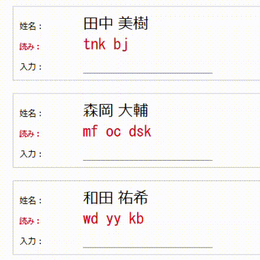

# direct-input23

direct-input23.ahk は、IME を使用せずに漢字を入力するための AutoHotkey 用のスクリプトです。




## はじめに

本スクリプトは、人名や住所など単漢字 (および複合語) の高速入力を目的とした漢字入力システムです。

運用には AutoHotkey を利用します (本スクリプトのバージョン 2 以降は v2、それより前のバージョンは v1 を使用します)。

## このスクリプトでできること

- IME を使用せずに漢字を入力します。
- 変換キーが不要です (入力した読みが辞書にマッチした時点で自動的に変換されます)。
- 漢字の読みは 2 文字または 3 文字。
- ひらがな、カタカナをローマ字入力できます (マッピングの変更も可能)。
- 参照辞書を利用して、漢字を音読み・訓読み・部首名の AND 検索で入力できます (デフォルトでは人名漢字＋ JIS 第 1 水準漢字に対応)。
- 使用中の IME からユーザー辞書をエクスポートして、参照辞書として使用できます (加工が必要です)。

本入力スクリプトでは、漢字 1 文字または 1 つの複合語を、半角 2 文字または 3 文字の読みで変換します。また、「変換」キーを使用しないので (慣れれば) 非常に高速な入力が可能です。

簡単に言うと、漢字・語句のすべてに一意の読みを登録し (た上で入力者が**これらすべてを覚え**) ておき、キーが押されるたびに辞書を引いてマッチするものがあれば書き換えるという力業のスクリプトです。

読みを思い出せなくても、参照辞書 (デフォルトでは JIS 第 1 水準 + 人名漢字) を検索したり、IME と行ったり来たりもできますので安心してご利用ください。

## 更新履歴

現在の最新バージョンは 2.0.0 です。

### バージョン 2.0.0 で追加された機能

- 動作環境を AutoHotkey v2 に移行しました。

- 参照辞書を引いて漢字入力できるようになりました。音読み・訓読み・へん・つくりなどを AND 条件で検索できます。

- 仮名 (ローマ字入力)・英数記号を直接入力できるようになりました。

- 情報ウィンドウの背景が半透明になり、移動も可能になりました。

### バージョン 2.0.0 で廃止された機能

- F1 モード (あらかじめ決めておいた変換モードで IME を起動する機能。今バージョンから、入力文字種ごとに入力モードを用意しました)

## 動作環境

本システムのバージョン 2 以降
- AutoHotkey v2 が動作する環境

本システムのバージョン 2 未満
- AutoHotkey v1 が動作する環境

動作確認は次の環境で行っています。

- Windows 11 + Autohotkey v2.0.19
- Windows 11 + AutoHotkey v1.1.24.02

使用中の IME によっては機能が制限される場合があります。

## インストール方法

### ダウンロード先

本スクリプトは Github にて公開しています。

<https://github.com/kouie/direct-input23>

zip をダウンロードしてください。

### インストール手順

ダウンロードしたファイル一式を適当なフォルダに配置してください。AutoHotkey がすでに稼働している環境であれば、サンプルの辞書を使用してすぐに実行できます。

AutoHotkey v1 環境で使用する場合は、古いバージョンになりますが v1 フォルダにある direct-input23-v1.ahk を使用してください。ファイルを 1 つ上の階層 (direct-input23.ahk や ini ファイル・辞書ファイルがあるフォルダ) に移動してから実行してください。v1 対応版のバージョンは 1.3.0 です。

メモ: 同梱している辞書ファイルはあくまでサンプルとして使用してください。この辞書はスクリプト作者が独自ルールで作成したものであり、この中の読みを覚えてもまったくメリットはありません。本入力システムを継続してご利用いただく場合は、ご自身で読みのルールを決めて新しく辞書を作成することをお勧めします。

最適な辞書を作成するには試行錯誤が必要だと思いますが、支援ツールもいくつか用意してありますので挑戦してみてください。

## 動作確認と基本的な使い方

スクリプトの本体 `direct-input23.ahk` をダブルクリックして実行します。

画面左上に半透明の情報ウィンドウが表示されていれば無事起動できています。メモ帳を開いて次のように入力してみてください。読みの大文字と小文字は区別されますので、ここではすべて小文字で入力してください。

注意: Windows 11 の新しいメモ帳で IME の状態をうまく検知できない場合がありました。ここでは念のため古いバージョンのメモ帳 (c:\\Windows\System32\notepad.exe) を使用してください。

```
nkdmttol
```

同梱の辞書には `nk=中、dm=山、tt=高、ol=尾`と登録されていますので、入力が終わったときに

```
中山高尾
```
に変換されていれば動作 OK です！

ここでいったんメモ帳の作業を中断して、次のデモサイトをご覧ください。

[漢字入力システムデモ (https://kouie.github.io/di23demo)](https://kouie.github.io/di23demo)

デモサイトは direct-input23 の動作を Web ページ上に再現したもので、[チュートリアル] のタブで (簡単ですが) 2 文字読みの漢字の入力、3 文字読みの漢字の入力、および再変換機能を体験できます (お題の 1 ～ 6)。

デモサイトで動作しているのは、変換・再変換機能だけの簡易版です。本スクリプトは他にも辞書の切り替え、かな・英数入力モード、参照辞書の検索などの機能を備えています。各機能の詳細については、この後の説明を参照してください。

**重要** : 1 文字削除にはホットキーの `^h` を使用してください。このホットキーで {Backspace} を SendInput すると同時に、本システムの入力バッファを操作しています。Backspace キーを使用すると正しく変換できません。

各機能を利用するためのキーは、AutoHotkey のホットキー機能を使用して割り当てています。キーマップを集中的に変更するような気の利いた機能は用意していませんが、ご自身の環境や設定にあわせて/使いやすいように、スクリプトファイルの該当箇所を直接編集してご利用ください。

## 入力機能

本スクリプトには、変換キーを使用せずに変換を行う「漢字モード」のほかに、次の入力モードがあります。

- **「英数」モード**: 通常のキーボード入力と同様に、キーボードの各キーに対応する文字を半角で入力します。

- **「ひらがな」モード / 「カタカナ」モード**: かな文字をローマ字で入力できます。ローマ字とかな文字の割り当ては定義ファイルに記述しますので、自由に変更できます。

- **辞書引きモード**: 漢字モードの辞書とは別に用意した参照辞書を、音読み・訓読み・部首読みの AND 条件で検索します。リポジトリに標準で用意している辞書では「JIS 第 1 水準漢字 ＋ 人名漢字」を引けます。

各モードの詳細を以下に示します。

### 英数モード

`F1` を押してこのモードに入ると、入力した文字は変換処理を通らずにそのまま出力されます。

このモードでは、情報パネルの背景色が暗い灰色、文字色が白色になります。


モードの関係 (遷移可能性) は次のとおりです。

- このモードには、「漢字」、「ひらがな」、または「カタカナ」モードから遷移できます。

- このモードからは、いずれのモードにも遷移できます。

- このモードでもう一度 `F1` を押すと「漢字」モードに遷移します。

### ひらがな/カタカナモード

入力した文字を漢字変換処理に送らず、モードに応じた仮名文字に変換して出力します。

`!m` を押すと「ひらがな」モードに、`!n` を押すと「カタカナ」モードになります。

「ひらがな」モードでは情報パネルの背景色が薄いオレンジになり、「カタカナ」モードでは黄色になります。

モードの関係 (遷移可能性) は次のとおりです。

- これらのモードには、「漢字」、「英数」、またはもう一方の仮名モードから遷移できます。

- これらのモードからは、いずれのモードにも遷移できます。

- それぞれのモードでもう一度 `!m` または `!n` を押すと、「漢字」モードに遷移します。

仮名の入力方法は既定でローマ字入力となります。この変換ルールは `dictionary-hirakata.txt` という名前の辞書ファイルで定義しています。
```
a=あ,ア
i=い,イ
```
のように、「読み=ひらがな,カタカナ」という形式で 1 文字分を 1 行ずつ記述します。行数・読みの長さに制限はありませんので、必要に応じてエントリを編集・追加して使用してください。

### 辞書引きモード

漢字モードの辞書に登録していない漢字を入力したり、登録はしたけど読みを思い出せない漢字を入力したりできます。

`F9` キーを押すと、情報パネルの背景色が綠色に変わり「辞書引き」モードになります。

入力カーソルの位置にそのまま入力したい文字の読み (音読み・訓読み・へん・つくりなど) を入力します。入力内容に応じてカーソルの下に候補ウィンドウが表示されますので、`^1` ～ `^9` で番号の付いた候補を選択するか、`^Enter` で先頭の候補を選択してください (`^1` と同じです)。入力した読みが選択した候補に置き換えられ、入力モードが「漢字」に遷移します。

入力した読みに一致する候補が 10 件以上ある場合は、別の読みをスペースで区切って追加入力し、候補を絞り込みます。

入力した読みは部分一致で検索されますので、「話」という漢字は「なし」でも「はな」でも検索できます。ただし、入力した読みの長さが 1 文字の場合は完全一致での判定となります。たとえば、入力した読みが「あ」の場合、「亜」はマッチしますが「赤」はマッチしません。

モードの関係 (遷移可能性) は次のとおりです。

- このモードには、「漢字」、「英数」、「ひらがな」、または「カタカナ」モードから遷移できます。

- このモードからは、「漢字」モードにのみ遷移できます。

- このモードでもう一度 `F9` を押すと、「漢字」モードに遷移します。

#### 参照辞書について

入力したい漢字の読みの種類が少なく、同音の漢字がほかにたくさんあってなかなか絞り込めない場合は、参照辞書に読みを登録することもできます。

既定の参照辞書は、`dictionary-jyoyo-jinmei.tsv` という名前の tsv ファイルです。このファイルには、1 文字分のエントリが 1 行ずつ、常用漢字 (本表)＋JIS 第 1 水準漢字の範囲で登録されています。

たとえば、「桜」という漢字は次のように登録されています。

```
桜	櫻	ヨウ オウ き よう おう さくら きへん
```

第 1 フィールドが登録漢字、第 2 フィールドは旧字体 (旧字体がない場合は空の文字列。候補ウィンドウでは、第 1 フィールドの漢字の次 (下) に表示されます)、第 3 フィールドが読みとなります。読みはスペース区切りで複数指定できます。IME のユーザー辞書などに登録している読みがある場合は、ここに追記しておくと辞書引きモードでその読みを利用できるようになります。

読みを追加するだけでなく、参照辞書に未登録に漢字を登録することもできます。上に示したものと同じ形式で、ファイルの末尾に追記してください。

追記した漢字がすでに登録されていて重複してしまった場合は、ファイルの末尾に近い方のエントリが有効になります。

メモ: 現在のところ、スクリプト内から参照辞書にエントリを追加する機能はありません。エディタなどのツールで tsv ファイルを直接開いて編集してください。

### 漢字モード

本スクリプトのメインとなる、変換キーを使用せずに漢字を入力するモードです。スクリプトの起動直後は、このモードになります。

モードの関係 (遷移可能性) は次のとおりです。

- このモードは他のすべてのモードと相互に遷移できます。

- 他のモードから漢字モードに遷移するには、各モードへの切り替えキーをもう一度押すか、`^Space` を押します。

### IME の動作について

IME を起動するには `半角/全角` キーを使います。IME はいずれのモードからでも起動できますが、IME をオフにすると必ず漢字モードになります。

IME をオフにする場合も `半角/全角` キーを使用しますが、`^Space` でも IME をオフにして漢字モードに遷移します。IME での入力中に `^Space` を使うと、キーを押した時点で未変換の入力はキャンセルされますのでご注意ください (キャンセル時の IME 側の動作は IME の設定を参照してください)。

## 変換に関する支援機能

### 再変換機能

本スクリプトの漢字変換処理では、読みが最長一致するエントリが常に選択されます。つまり、ある 2 文字読みのエントリと、別の 3 文字読みのエントリの先頭 2 文字が一致している場合は、常に 3 文字読みのエントリに変換されます。

たとえば、辞書に `yy=祐、kb=希、yyk=悠` と登録されているときに「祐希」を入力する場合、読みのとおりに「yykb」と入力すると、最長一致の規則に従って「悠b」と変換されてしまいます (トップ画像の 3 番目の例です)。

このような場合はホットキー `^l(エル)` を押すと、3 文字マッチの変換を解除して、区切り位置を最初の 2 文字の後に修正できます。区切り位置の変更により 3 文字目が読みの 1 文字目となるので続けて入力するか、再変換前の状態で 4 文字以上入力している場合は、3 文字目以降がまとめて変換処理されます。

ややこしいですが、このケースだと、

```
yyk → 悠 → ^l → 祐k → b を入力 → 祐希
もしくは
yykb → 悠b → ^l → 祐希
```
の 2 とおりで入力できます。

再変換は直前の変換に対してのみ有効です。辞書に `bk=黒、kk=子` というエントリが登録されていて、「祐希子(=yy kb kk)」と入力しようとして一気に「yykbk」まで入力してしまうと「悠黒」と変換されてしまい、再変換が機能しません (直前の変換が「黒」であるため)。

基本的に、本システムでは「誤変換」は発生しない仕組みですが (すべての漢字の読みが一意であるため)、このようなケースで意図しない変換が混入してしまう可能性があります。これを完全に防ぐには、単語登録において少し工夫が必要になります。

後の「動作の仕組み」の「[入力バッファ](#入力バッファ)」セクションでも、スクリプトの仕組み的な部分を含めて説明していますので、そちらも参照してみてください。

### 情報ウィンドウ

本スクリプトの実行中に画面左上に開く情報ウィンドウには、辞書セットの番号、直前の変換 (読み)、入力バッファの状態、辞書引きモードの検索用バッファの状態が表示されます。

モードやスクリプトの動作状態に応じて、背景色が次のように変化します。

|モード|色|文字色|
|---|---|---|
|漢字|灰色|黒|
|ひらがな|薄いオレンジ|黒|
|カタカナ|黄|黒|
|英数|濃い灰色|白|
|辞書引き|緑|黒|
|IME ON|茶|黒|
|サスペンド|濃いオレンジ|黒|
||||

このウィンドウの表示は `^!p` で変更可能で、キーを押すごとに「通常(タイトル行無し) → タイトル行付き (移動用) → 非表示 → 通常 →…」の順に切り替わります。


### 変換バッファの先頭にある余計な文字を取り除いて変換する機能

機能名が長いですが、変換バッファの先頭に余計な文字が入っていて長々と入力したのにまったく変換されてなかった、という状況への対応です。

入力欄がうっかりこうなってしまったときでも、
```
8sarkwsdm3
```
変換の邪魔をしている先頭の「8」を取り除いて、こう
```
桜川貞光
```
一発変換です (sar=桜、kw=川、sd=貞、m3=光 です)。

邪魔な文字を取り除く方法は 3 とおり。既定で次のホットキーに割り当てています (変更可能です)。

+ ``!d`` : 先頭の 1 文字を「削除」して残りのバッファを変換。
+ ``!s`` : 先頭の 1 文字をバッファから「追い出し」て残りのバッファを変換。追い出した文字はそのまま確定済となります。
+ ``!e`` : 1 文字目からバッファ内の最初の英子文字の手前までを追い出して変換。こちらも、追い出した文字はそのまま確定済となります。

本システム本来の用途の名前入力ではあまり使いどころのなさそうな本機能ですが、住所入力では力を発揮します。

たとえば「c1=丁目、c2=番、c3=号」のように単語登録をしているときに、「1丁目2番3号」のような入力は結構めんどいです。
```
1(確定)c12(確定)c23(確定)c3
```
のような入力になると思いますが、絶対に IME 使った方が早そう (速そう) です。

本機能を使うと次のように続けて入力できます。
```
1c12c23c3
```
(この時点でめんどくさいんですが、辞書登録を工夫すればもっと楽になるはずです) この状態で ``!s`` を 3 回押すと、
```
1丁目2番3号
```
ができあがります。

ここで使用したのは「追い出し」型の変換です。バッファの先頭 1 文字を追い出して (確定済み) にして残りのバッファを変換。この時点で先頭にある 「c1」が「丁目」に変換されます。変換できなかった残りの部分 (2c23c3) はバッファに残りますので、この操作をあと 2 回繰り返せば「2番3号」の部分も無事変換できます。

「削除」型は先頭の 1 文字をバッファだけでなく、入力欄からも削除しますので、上の例でこのタイプを使うと、
```
丁目番号
```
のように数字部分 (変換できない部分) を抜いた状態に変換されます。

これらの機能は数字だけでなく、英文字も対象になりますので、気付いたらタイプミスで余計な文字が入っていた場合などにも使用できます。

残りの「1 文字目から最初の英語小文字の手前まで」を追い出す (長い) タイプは、入力対象が
```
1024-5-2号棟
```
のようなケースで使うと、「1024-5-2」をまとめて追い出して、残りの「号棟」を変換できます。

#### 一意に決まらない変換があった場合

不要な文字を取り除いた後のバッファは先頭から順に自動で変換され、変換不能な箇所が見つかればそこで停止します。バッファの途中に一意に決まらない読みの並びがあった場合は、最長一致の原則に従って 3 文字の読みが優先的に変換されます。入力時に再変換を予定していた場合、できあがりの変換は意図したとおりになりません。再変換が必要な位置がバッファの終わりであれば、バッファ内の文字列がすべて変換された後に通常どおり再変換機能を利用できます。

### カナと英数字の入力支援

漢字モードのまま英数・仮名文字を入力する機能です。

メモ: v1 で漢字以外を入力するために実装した機能です。v2 からは入力文字種ごとに専用のモードを追加していますが、この機能もそのまま使用できます。2～3 文字のカナを入力する場合や、モード切替のキーバインドが少し遠い場合は、こちらが速い/便利かもしれません。不要な場合は、キーマップを解除してください。

入力内容の一部にカナが含まれるような場合に (たとえば「サメ子」さんとか)、モードを変更したり IME を ON にしたりしなくてもカナを入力できます (ただし、ちょっと操作にクセがあります)。

#### かな・カナ入力

ひらがな・カタカナ用の辞書 (ひらがなモード・カタカナモードで使用する辞書と共通) を使用して、未変換の入力 (バッファに入っている部分のみ) を一括でかな/カナ変換します。

使い方は、

```
furuo--to
```

のように入力した状態で、ひらがな変換 (初期状態では `!o`) またはカタカナ変換 (同じく `!i`) のホットキーを入力します。上の場合は、

```
ふるおーと (カタカナ変換の場合は「フルオート」)
```
に変換されます。

入力の際、漢字辞書の方に「fu」や「fur」などの登録があるとその時点で**漢字**変換されてしまいますので、その場合は 1 文字目にアルファベット以外の文字 (プレフィックス) を入力して辞書のエントリにマッチしないようにしてください。デフォルトの状態だと、アルファベット以外の文字として数字キーとピリオド、ハイフン (マイナス記号)、およびカンマが使えます。
```
,samixtuto
```
のように入力すれば漢字変換をキャンセルできます。かな・カナ変換では、バッファの先頭にあるアルファベット以外の文字をすべて無視しますので、これをカタカナ変換すると、
```
サミット
```
になります。カンマの分、入力が 1 文字増えてしまいますが、打ち直しなどの手間を考えると、常にプレフィックスを付けることをお勧めします。

変換はカナ専用の辞書に基づいて、文字列の先頭から最短マッチを繰り返して一括処理されます。この辞書は `direct-input23.ini` ファイルの `[kanaDictionary]` セクションで `dict=` に続けて指定します。

語句 (文字) の登録は漢字辞書と同じように、読みと語句を「=」で繋いで指定しますが、

```
a=あ,ア
i=い,イ
```
のように、ひらがなとカタカナをカンマで区切って記述します。読みの文字数に制限はありませんので、入力スタイルに合わせて編集してご利用ください。また、エントリの数も任意ですので、同梱の辞書で変換できない文字がありましたらエントリを追加してお使いください。


#### 英数字入力

未変換状態の (バッファに入っている) 文字列をそのまま確定します。

かな変換でも使用したように、入力の 1 文字目にカンマを使用して漢字変換をキャンセルします。バッファに文字列が入っている状態でもう一度カンマを入力すると、バッファ先頭のカンマを削除した上で、現在の入力内容を確定します (バッファから追い出します)。

たとえば、「in」や「inf」が漢字辞書に登録されていても、
```
,infinity,
```
と入力すれば
```
infinity
```
を確定できます。

確定と同時にバッファはクリアされます。また、1 つ目のカンマを入力した時点でもバッファをクリアしますので、カンマを続けて 2 回押すとバッファをすばやくクリアできます。

メモ: この機能ではカンマを出力できません。カンマが必要な場合は「英数」モードまたは IME をオンに切り替えて入力してください。

注意: かなカナ入力と英数字入力のどちらも、本システムで管理していない文字が混じると、正しく変換されません。変換に使用できる文字だけを使うか、スクリプトを編集して使用したい文字を追加するか、いずれかで対応してください。

## 動作の仕組み

### 入力バッファ

本スクリプトを使用するうえでバッファの仕組みを理解しておくと、操作性がぐっと向上します。少しややこしいですが、ここで 2 文字・ 3 文字の変換の仕組みを説明します。

本スクリプトを通して入力したキーは、入力行に出力されるとともに本システムの入力バッファ (=変換用バッファ) にも追加されます。バッファ内が 2 文字または 3 文字となったときにバッファの内容を辞書と照合し、一致するものが見つかれば変換 (=入力行の書き換え) を行います。

辞書の検索は、入力した読みに対して最長一致となるように行われます。つまり、2 文字の読みで変換が行われた後、その 2 文字とその後に入力した 1 文字を組み合わた文字列が 3 文字読みのエントリとして登録されていた場合は、先の変換を破棄して、後から見つかった単語に置き換えます。ページトップの動画だと、「大輔」の部分でこの動作を確認できます (「ds」で「山崎」に変換された後、続く「k」の入力で直前の「山崎」が BS 2回で破棄され、「大輔」に変換されています)。

「変換」キーを使用しない仕組み上、辞書にマッチするエントリがあれば 3 文字目の変換は必ず発生してしまいます。最初の 2 文字読みの変換を明示的に確定したい場合は、`^!Space` などの clearBuffer() 関数を呼び出すホットキーを使用してください (入力バッファをクリアします)。  

もしくは、先に説明した再変換機能を使用しても、直前の変換 (3 文字読みの変換) を取り消して、最初の 2 文字の変換を確定できます。

意図しないタイミングで 3 文字変換が発生すると、間違った内容の混入や入力速度の低下に繋がります。意図しない変換の発生を避けるには、登録する単語の読みを工夫してみてください。たとえば、3 文字読みにしか使用しない文字を設定したり、3 文字読みの 2 文字目に使用できる文字を制限したりするなど、読みのルールを決めることで変換のタイミングをコントロールできます。

重複をチェックするツールや、辞書編集ツールも用意していますので、これらを辞書の最適化にご利用ください。

### IME の併用について

IME と本システムを併用する場合、IME と本スクリプトのどちらかが常にオンになるように動作します。

+ 本スクリプトによる変換を有効にすると、IME がオフ
+ 本スクリプトによる変換を無効にすると、IME がオン

となります。

IME のオン/オフは通常どおり `半角/全角` キーで行いますが、実際のキー入力を発生させずに、スクリプト側で IME の状態を変更しています。環境によって、この辺りの動作が問題になりそうな場合はご注意ください。

メモ: 使用するアプリケーションによっては、IME の状態をうまく検知できない場合があります。このような場合でも本スクリプトのバージョン 1 だと正常に動作するケースがありますので、そちらも検討してみてください。

## 辞書に関する機能

### 登録済みエントリの「読み」検索

辞書に登録した漢字の読みが思い出せない場合は、辞書引きモードまたは IME を利用して対象の漢字を入力した後、この機能を利用して確認できます。

カーソル位置から 1 文字戻って文字列を取得し (内部で `+{LEFT}^c` します)、クリップボードの内容で辞書内を検索して、結果をメッセージボックスに表示します。検索した単語が登録されていない場合は、メッセージボックス自体表示されません。

メッセージボックスを閉じると IME はオフになります。

### 単語登録

辞書エントリを、クリップボード経由で辞書ファイルに登録します。

```
tak=高尾
```

のように、辞書エントリと同じ形式の文字列をクリップボードにコピーしたうえで、`^F8` を押してください。
同じ読みのエントリがすでに登録されている場合は該当エントリを修正するかどうか、同じ読みがない場合はエントリを追加するかどうかを確認するメッセージが表示されます。

一度に登録できるエントリは 1 件のみで、新規のエントリは辞書ファイルの末尾に追記されます。

変換できるのは読みがすべて小文字のエントリだけです。大文字を含む読みも登録できますが、現在のところ変換の対象になりません。

メモ: バージョン 1 では、変換がトリガーされるのは入力した文字が小文字または記号の場合だけでした。たとえば、辞書に「wf=和風」というエントリがあるときに「wF」または「WF」では変換は発生しませんが、「Wf」は「和風」に変換されていました。バージョン 2 以降では、読みの大文字と小文字を常に区別するようになりましたので、「和風」に変換されるのは「wf」のみです。

辞書を更新する際に、``dic_backup\日付時刻 + 辞書ファイル名`` という形式の名前でバックアップファイルが作成されます。バックアップは辞書ファイルを更新するごとに作成されますので、追加・変更するエントリがたくさんある場合は直接テキストエディタで編集することをお勧めします (「バックアップを作成せずに更新」ボタンはいつか作ります)。

エントリを削除する機能は (いまのところ) ありません。エントリを削除したい場合もテキストエディタで編集してください。

辞書はたいへん貴重な資産ですから、定期的にバックアップを取って大切に扱いましょう (本システムの本体は辞書である説)。

重要: 辞書ファイルの改行コードは `CRLF` です。

### 辞書の切替

使用する辞書は `direct-input23.ini` ファイルに指定し、少なくとも 1 件の登録が必要です。

複数の辞書を登録しておくと、これらを切り替えながら使用できます。たとえば、人名 (漢字) 用の辞書ほかに人名 (カナ) 用の辞書を追加したり、住所用の辞書を追加したりもできます。

辞書の登録は .ini ファイルの次のセクションで行います。

```
[FileSet1]
name=人名
dict=.\dictionary_name.txt
log=.\convert_history_name.txt
[FileSet2]
name=住所
dict=.\dictionary_address.txt
log=.\convert_history_address.txt
[Currentset]
set=1
```
`name` : 辞書セットの名前 (識別用ラベル)

`dict` : 辞書ファイルの名前

`log` : 変換履歴の出力先ファイルの名前

を 1 セットとして、`[Fileset(番号)]` セクションに記述します。

`[CurrentSet]` セクション: `set=` に設定されているインデックス番号の辞書が、スクリプトの起動時に読み込まれます (インデックス番号は、ini ファイルに記述されている辞書セットに対して、上から順に 1、2、… の連番で割り当てられます)。

スクリプトをリロードする際に `!F11` を使用すると、この値を現在のセット番号で書き換えてからリロードを行います (つまり、切り替えたファイルセットを、リロード後にそのまま使用できます)。このセット番号の書き換えは、トレイアイコンの右クリックメニューからリロードした場合は発生しません。

初期状態では `!F1`、`!F2` にそれぞれ辞書セット1、2 への切替を割り当てています。また `!F3` で辞書セットの選択ダイアログが表示されますので、そちらでも変更できます。これらのホットキーは変更可能です。

履歴機能が有効で未出力の履歴データがある場合は、辞書の切替前に自動で出力されます (履歴機能については後述します)。

単語の登録・修正機能は、その時点でアクティブな辞書に対して実行されます。

## 設定機能

本スクリプトの動作に関する設定は `direct-input23.ini` で行います。

#### 動作対象ウィンドウの指定

本スクリプトの動作対象となるウィンドウを設定します。

`[Group]` セクションの `group=` に `,` 区切りで指定します。
```
[Group]
group=メモ帳,Chrome
```
注意: 行の末尾に `,` を付けないでください。

### 入力履歴と再変換履歴

定期的に入力内容・再変換の履歴をログファイルに出力します。統計情報の作成に利用したり、辞書の最適化に利用したりできます。

入力および再変換した単語をまずバッファに格納し、入力デバイス (キーボードとマウス) の状態をタイマーで定期的に監視して、アイドル状態のときにファイルへ出力 (追記) しています。

ログファイルには次のような内容が出力されます。
```
2024-10-12 08:50:38
裕 石 千 早川 一 藤岡 平 鷲 一
rc 2024-10-12 08:50:38
rc 廣
```
履歴データを出力した日時と書き込み時点でバッファに格納されていたデータ (スペース区切り) を、それぞれ 1 行で追記します。
先頭に「rc」がついている行は再変換の履歴です (再変換前の漢字です。再変換後の漢字は「rc」が付いてない方に入ってます)。

書き込みを行った後バッファはクリアされ、次の書き込みが実行されるまで再び記録を続けます。

`!F11` キーでシステムリセットを行う際、書き出していない履歴データが残っている場合は、これらのデータを書き出した後にリセットが実行されます。

#### 設定場所

設定ファイル `direct-input23.ini` の次のセクションで指定します。

`[LogEnable]` セクション

・`enable=1` : 履歴の出力を有効にします。
または、

・`enable=0` : 履歴の出力を無効にします。この場合もバッファへの格納は行っています。ログファイルへの出力処理で書き込みするかどうかの違いです。

`[MonitorTimer]` セクション

・`timer=[数値 (ミリ秒)]` : デバイスの監視タイマーを設定します。初期値は `60000` (ミリ秒)。この間隔でデバイスを監視し、デバイスが使用されていない状態が 10 秒以上続いていれば履歴バッファを出力します。

出力先ファイルは、辞書ファイルと一緒に ini ファイルに設定します。「[辞書の切替](#辞書の切替)」のセクションを参照してください。


## その他の機能

### サスペンド

`!F12` で入力システムを停止します。サスペンド中は、情報ウィンドウの背景がオレンジ色に変化します。

### リセット

`!F11` でシステムをリセット・再起動します。辞書を再読み込みする際や入力システムが不安定になったときに使用してください。

入力履歴の出力が有効な場合、ファイルへの書き出しが行われていない記録があれば、リセットの前に出力されます。


## 補助ツール

### 「一意に変換が決まらない単語ペア」チェッカー (dic-uniq-checker.py)

辞書に登録されている単語のうち、変換が一意に決まらない (＝続けて入力すると再変換操作が必要となる) 単語のペアを抽出・レポートする外部ツールです。

**使い方**

python が動作する環境で次のように実行します。

```
python dic-uniq-checker.py <dictionary-name> [-d]  [-i <ignore-characters>]
```

dictionary-name: チェックする辞書ファイルを指定します。

-d オプション (省略可): 出力ファイルの先頭に簡単な説明を追加します。

-i オプション (省略可): 指定した文字が読みの 3 文字目に使用されている単語を別カウントします。``-i abc`` のように複数の文字を指定できます。再変換が発生しても構わない単語を別集計にできます。

オプションはどちらを先に指定しても構いませんが、-i オプションに文字を指定しないまま後ろに -d オプションをつなげた場合、「-d」が -i オプションの引数と認識されます。不要な場合は -i を指定せずに使用してください。

解析結果は同じフォルダの ``uniq-check-results.txt`` ファイルに出力されます。

説明がわかりにくいと思いますので (特に -i オプションの説明は自分で読んでも何言ってるかよく分かりません)、実際の出力ファイルを見てもらった方がわかるかなと思います。

###  テーブル形式の辞書メンテナンスツール

登録済みの単語をテーブル形式で表示して編集できる python による外部ツールです。語句を登録・削除したり、登録単語の重複を確認したりできます。

別のリポジトリとして公開していますので、詳細については次のリンクを参照してください。

[テーブル形式の辞書メンテナンスツール](https://github.com/kouie/dic-maint)

## その他

本スクリプト、およびスクリプトの補助ツールの作成にあたっては、Claude Sonnet Sonnet 3.5 と Gemini 3.1 Pro を使用しています。

## 免責事項

当ソフトウェアの使用に関連して生じたいかなる損害、損失、またはトラブルについても、一切の責任を負いません。これには、データの損失、収益の損失、ビジネスの中断、およびその他の金銭的損失が含まれますが、これに限られません。

## ライセンス

本リポジトリの内容は、スクリプト本体 (および関連ファイル) と参照辞書データとで異なるライセンスが適用されています。

### 1. スクリプト本体と関連ファイル
スクリプト本体および関連ファイル (参照辞書の dictionary-jyoyo-jinmei.tsv を除きます) は、MIT License の下で公開されています。
詳細については、リポジトリ内の [`LICENSE`](./LICENSE) ファイルを参照してください。

また、本プロジェクトでは以下のサードパーティ製ライブラリを同梱、または一部利用しています。これらも MIT License またはそれに準ずるライセンスの下で提供されています。

- Misc.ahk (from UIA-v2): [Descolada/UIA-v2](https://github.com/Descolada/UIA-v2) - MIT License
- IME.ahk / IMEv2.ahk: eamat. 様 / kenichiro_ayaki 様（スクリプト内に出典情報を記載）

### 2. 参照辞書データ (dictionary-jyoyo-jinmei.tsv)

本リポジトリに同梱されている生成済みの辞書データ (dictionary-jyoyo-jinmei.tsv) は、Creative Commons Attribution-ShareAlike 4.0 (CC BY-SA 4.0) の下で提供されます。
利用や改変、再配布を行う場合は、同ライセンスの条件に従ってください。

#### データの出典とクレジット
この辞書データは、以下のオープンデータおよびパブリックドメインデータを組み合わせて作成 (改変) したものです。

* KANJIDIC2 (CC BY-SA 4.0) -
  This package uses the KANJIDIC2 dictionary file. These files are the property of the [Electronic Dictionary Research and Development Group](http://www.edrdg.org/), and are used in conformance with the Group's [licence](http://www.edrdg.org/edrdg/licence.html).
* 常用漢字・人名漢字・部首データ (CC0 1.0) -
  パブリックドメイン (CC0) として提供されているデータを利用しています。

